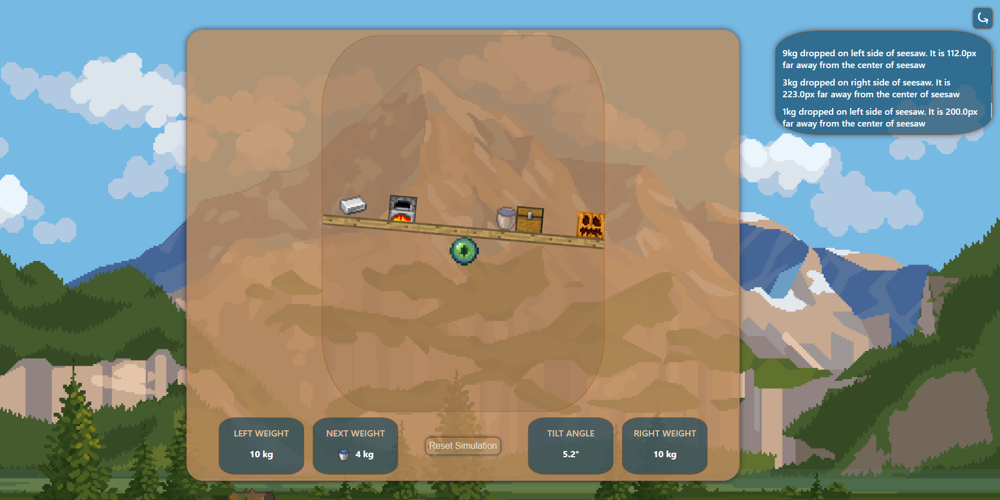

# Seesaw Simulation

I create physics simulation that demonstrates the principle of torque. Place weights at different distances from the pivot to observe how it affects the balance and tilt of the seesaw. This project was built with plain HTML, CSS, and JavaScript.

---

## Features

- **Physics Engine**: Click on the seesaw to drop a randomly generated weight. The simulation calculates the resulting torque and updates the seesaw's angle.
- **Dynamic UI Display**: The interface shows the total weight on each side, the current tilt angle, and the next weight to be dropped.
- **Placement Preview**: A semi-transparent "ghost" element follows the mouse, showing exactly where the next weight will land.
- **Action History**: A collapsible panel logs everything for a review of all moves.
- **Local Save**: The entire state of the simulation saved to the browser's storage. You can close the tab and return to your simulation exactly as you left it.
- **Reset Button**: A "Reset" button clears the seesaw, resets all calculations, and clears the session from browser's storage.
- **Audio**: A sound effect plays each time a weight is dropped.
